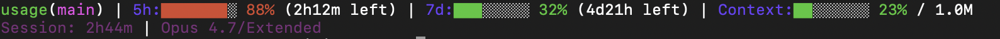

<p align="center">
  
</p>

# agentdeck

### Quota visibility for Claude Code, Codex, and Antigravity, built into the Windows system tray.

Keep Claude Code, Codex, and Antigravity quota in view while you work. `agentdeck` puts session limits, weekly limits, and cost context in the Windows system tray, so you can manage usage before it interrupts a session.

[繁體中文](README.md) · English &nbsp;|&nbsp; [Landing page](https://sanhsien.github.io/agentdeck/)

[](https://github.com/SanHsien/agentdeck/releases/latest)
[](https://github.com/SanHsien/agentdeck/actions/workflows/check.yml)
[](https://github.com/SanHsien/agentdeck/actions/workflows/codeql.yml)
[](https://www.python.org/)
[](#install)
[](#privacy--data-sources)
[](LICENSE)

> **This fork focuses on Windows.**
>
> It is a fork of [`aqua5230/usage`](https://github.com/aqua5230/usage), maintained independently with no upstream contributions planned. Development and verification happen on native Windows 11: Windows-specific problems — system tray, DPI scaling, path handling — get fixed first, with evidence from real runs.
>
> **macOS support was removed on 2026-07-29**: the PyObjC menu bar, the `.app` build, and the code behind them are gone, along with the PyObjC dependencies. For macOS, use [upstream](https://github.com/aqua5230/usage). Upstream's macOS implementation is kept in `reference/upstream-macos/` to compare against while porting.
>
> Other differences: the UI ships in Traditional Chinese and English only; upstream's Discussions and star count belong to that project and are no longer mirrored here. The landing page is served from this repo's `docs/`.

<p align="center">
  
</p>

`agentdeck` keeps your **Claude Code, Codex, and Antigravity** quota pinned to the system tray, color-coded so warning levels read at a glance. Claude Code and Codex numbers are read passively from local files already on your machine, and reading them **never calls Anthropic or OpenAI's LLM APIs** — so watching your quota never adds to your token usage. Antigravity quota comes from Google's official quota endpoint, using the sign-in the Antigravity CLI already stores locally.

## Why agentdeck?

Running out of quota mid-session is expensive — especially during a long refactor or debugging run that depends on Claude Code. `agentdeck` surfaces 5-hour and weekly limits *before* you hit the wall, and keeps them visible the whole time. There's no command to run and no page to open; the answer is just there, where you already look.

## Quick Start

Download `agentdeck-windows.zip` from the [latest release](https://github.com/SanHsien/agentdeck/releases/latest), unzip it, and run `agentdeck.exe` — no installer needed.

A quota icon appears in the system tray: left-click for the panel, right-click for the menu. For the full setup flow, see [Install](#install) below.

## What You Get

### Live Visibility

- **Always-on Monitor:** Your quota lives in the system tray, color-coded from green to red. Click when you want the full session, weekly, and per-project breakdown.
- **Antigravity Support:** Antigravity (Gemini) session and weekly quota show up as a third card in every panel. Numbers come straight from the official quota API, using the sign-in the Antigravity CLI already keeps on your machine — refreshed every few minutes, with live reset countdowns.
- **Service Status Alerts:** An orange-red banner appears when Claude Code, Claude API, or Codex API has an outage or degraded performance, read from their public Statuspage.io pages — never an LLM usage API. Antigravity isn't covered; it has no public status page.
- **Context Nudges & Notifications:** When your context window hits 70%, the status line nudges you to `/clear` or `/compact` to prevent token waste. You can also opt-in to system notifications for quota limits and recoveries.
- **Hide Sections:** Only use one or two of the tools? Hide the Claude Code, Codex, or Antigravity section from the tray and panels completely with a single click.

### Workflow Helpers

- **Progress Concierge:** Open a new Claude Code session and `agentdeck` hands your last progress straight to the AI, including your last request, uncommitted changes, and unfinished todos. No `/resume`, no recap. Fully local, off by default.
- **Token Saver:** A tray-menu toggle asks Claude Code and Codex to answer more tersely, saving output tokens while keeping code and error messages byte-exact. A light reminder keeps long conversations from drifting back to verbose — tested to keep late replies ~40% shorter.
- **Token-waste Health Check:** A daily background diagnosis scans your logs for waste, including repeated file reads, polluter directories, and noisy Bash output. If it finds issues, a one-line heads-up appears; say "show me" and the AI walks you through fixes.
- **Resume After the Quota Resets:** When the 5-hour allowance runs out mid-task, the work is picked back up once the quota returns, and you get a notification when it finishes. The wait is handed to the Windows scheduler, so a sleeping machine does not miss it; nothing is scheduled once the 7-day figure is high, so one night cannot spend the whole week. Off by default — enable with `"auto_resume": true` in the preferences file.

### Reporting & Insight

- **Deep HTML Reports:** Shareable HTML reports of daily and weekly token trends, project rankings, and cost — including a Year in Review with a contribution heatmap and "Wrapped" summary. Export as .html, .csv, or .png, fully offline, with optional project-name masking.
- **TUI & CLI:** Prefer the terminal? Run the rich TUI dashboard with `uv run --no-sync python main.py --tui`, or generate deep analytics with `uv run --no-sync python usage_cli.py report`.

### Experience & Customization

- **10 Visual Themes:** Switch between panel styles including Classic, Matrix, Windows 95, Newspaper, Cloud Observation, Midnight Aquarium, Prism Arcade, Black Hole, World Cup 2026, and Lepidoptera (blueprint).
- **Drag to Reorder:** Grab any quota card and drag it up or down to swap the order — the arrangement is shared across every theme and survives restarts.
- **AI Talent Market (our own implementation):** Installs ready-made roles into **every AI tool this machine actually has** — Claude Code (`~/.claude/agents/*.md`), Codex (`~/.codex/agents/*.toml`), and Cursor (`~/.cursor/agents/*.md`). Cursor documents the same markdown-with-frontmatter shape as Claude Code, so they share a renderer; Codex's TOML is rendered separately. Tools you do not have are left alone. Five packs, fifteen roles: engineering, writing, product, data, and operations & security. Upstream sourced its roles from a closed binary whose source and distribution repos are both 404 to everyone else and which only shipped for macOS, so nobody cloning the public repo could use the feature. This fork replaced it with an open implementation: role definitions live in [`personas/`](personas/) and can be edited or extended. If you hand-edit an installed role the panel flags it and offers a restore. **If you already have an agent of the same name, installing backs it up first and tells you the backup filename.**
- **AI Council:** Open a dedicated window and run a multi-round discussion between Claude Code, Codex, and Antigravity — pick participants, models, AI Talent Market personas, and a debate style, with a token estimate up front. Steer it between rounds, see who dissents in the consensus tally, and let it stop early once everyone agrees. Seats can reference real files via an optional read-only folder.
- **Changelog:** Opens this project's [changelog](https://github.com/SanHsien/agentdeck/blob/main/CHANGELOG.en.md) straight from the tray menu, so you can see what changed in the version you are running.
- **Spirit Companions:** A small animated white silhouette lives beside your usage percentages — a phoenix for Claude, a dragon for Codex, a lion for Antigravity. Each accelerates dynamically as its own tool's token burn rate climbs.
- **Automatic Localization:** UI text is available in Traditional Chinese and English, automatically matching your system settings. Every Chinese locale (Simplified included) resolves to Traditional Chinese; everything else falls back to English.

## Privacy & Data Sources

- Claude Code and Codex numbers are read **only from local log files** on your machine; reading them **never calls Anthropic or OpenAI's LLM APIs**.
- Antigravity quota requires network access, and only if you use it: quota is fetched from Google's official quota endpoint using the OAuth credential the Antigravity CLI already stored after sign-in — on Windows that credential is read from Credential Manager or a local token file, depending on CLI version. `agentdeck` reads that credential without writing it back and keeps any refreshed access token in memory only; the call itself only reads quota metadata and never consumes your model quota.
- Background network activity: the Antigravity quota/token endpoints above, public Claude and Codex status pages to flag outages, a public model-pricing table to estimate cost (falls back to built-in prices offline), and occasionally checking GitHub for a new version. Claude Code and Codex log contents are never uploaded.

## Where agentdeck Writes

Everything this tool knows lives on your own disk. These are the only things it touches:

| Path | Purpose | Written by |
|---|---|---|
| `~/.claude/agentdeck-statusline.py` | The statusLine hook installed into Claude Code | `--setup` |
| `~/.claude/agentdeck-status.json` | Quota snapshot the hook writes on every refresh; the UI reads it | the hook |
| `~/.claude/agentdeck-preferences.json` | Theme, panel, launch-at-login and other preferences | the app |
| `~/.claude/settings.json` | Only the `statusLine` field; the previous value is backed up under `settings["agentdeck"]["previousStatusLine"]` | `--setup` |
| `~/.agentdeck/` | Caches for pricing, service status and history, plus council and persona state | the app |
| `~/.agentdeck-reports/` | HTML reports you generate | the app |
| `~/.agentdeck/autoresume-log.txt` | A record of every auto-resume run | auto-resume |
| Windows scheduled task `agentdeck-auto-resume` | One-shot trigger waiting for the quota reset; removed after it runs | auto-resume |
| `~/.claude/projects/`, `~/.codex/sessions/` | Usage sources | **read-only, never written** |

`--unsetup` removes the hook and restores the original `settings.json` value. The cache directory can be deleted at any time; it is rebuilt on next launch. Auto-resume is off by default; while it is off no scheduled task is created, and any existing one is removed.

## Requirements

- Windows 10 or 11
- Claude Code, Codex, or Antigravity has been used at least once (so local usage data exists).
- (Source runs only) Python 3.13.

## Install

1. Download `agentdeck-windows.zip` from the [latest release](https://github.com/SanHsien/agentdeck/releases/latest).
2. Unzip it anywhere and run `agentdeck.exe`. No installer, and nothing written to the registry unless you enable launch at login.
3. To start with Windows: tick "Launch at Login" in the right-click menu.

The tray UI requires Microsoft Edge WebView2 Runtime, which is normally included with Windows 10 and 11.

The tray icon updates with your Claude quota percentage; its tooltip summarizes the Claude and Codex windows. Left-click opens the 10 quota themes in WebView2. Right-click provides panel switching, refresh, launch at login, check for updates, and quit.

The panel **does not anchor to the tray icon**, by design: it is a free-floating window that remembers where you put it and stays open when you click elsewhere. Its first-run corner follows the taskbar — top-right if the taskbar is on top, hugging the left edge if it is on the left — and after that your position wins. Upstream later moved to the same floating model for exactly this reason: anchoring made the panel impossible to place by hand.

Known limits: the update prompt uses a system three-button dialog whose button labels Windows controls, so the message body spells out which button means what; and the AI Talent Market ships this fork's own role definitions ([`personas/`](personas/)), which differ from upstream's closed set.

## Running from Source

```powershell
uv sync --frozen --group dev --extra windows
uv run --no-sync python main.py            # system tray (default)
uv run --no-sync python main.py --tui      # terminal TUI
uv run --no-sync python main.py --mock     # preview with fake data
uv run --no-sync python main.py --doctor   # environment and hook diagnostics
```

Requires Python 3.13. Full setup notes are in the [development docs](docs/DEVELOPMENT.zh-TW.md).

### First Launch: Set Up the Status Line

If you've used Codex, `agentdeck` picks up its history automatically. For Claude Code, click the **"Set Up Status Line"** button in the app popover to install the sync hook.
Fully quit Claude Code afterwards and reopen it (closing the window is not enough).

Once set up, the bottom of the Claude Code window will show a status line like this:

<p align="center">
  
</p>

## Theme Gallery

Switch between **10 visual themes** directly from the UI:

<p align="center">
  
  
  
  
  
  
</p>

## Troubleshooting

If the system tray icon shows `--`, it's usually not broken — there's just no local data yet.

| Symptom | Likely cause | Fix |
|---------|--------------|-----|
| System tray icon shows `--` | No data yet, or Claude Code hook not refreshed | Run one Codex conversation. For Claude Code, click "Set Up Status Line" or run `uv run --no-sync python main.py --setup` |
| Accidentally hit "Quit" | Process terminated | Run `agentdeck.exe` again. |
| Status says "N minutes stale" | Claude Code isn't running | Open Claude Code and let it run |
| Codex section is empty | No Codex history found | Run a Codex conversation to generate logs |
| Today's cost shows $0.00 | Model pricing missing | Delete `~/.agentdeck/pricing_cache.json` or run with `$env:AGENTDECK_DEBUG=1` |
| Antigravity card is missing | Antigravity CLI not installed or not signed in | Install and sign in to the Antigravity CLI; the card appears automatically once a background quota fetch succeeds |

## Comparison

| Feature | agentdeck | ccusage | TokenTracker |
|---------|:-----:|:-------:|:------------:|
| Always on screen | ✅ | — | ✅ |
| Windows system tray | ✅ | — | — |
| Claude Code & Codex usage | ✅ | Claude only | ✅ |
| Antigravity (Gemini) usage | ✅ | — | — |
| Claude Code & Codex service-status alerts | ✅ | — | — |
| HTML deep reports & UI | ✅ | ✅ | — |
| AI Talent Market | ✅ | — | — |
| AI Council | ✅ | — | — |
| Progress Concierge & Token Saver | ✅ | — | — |
| Token-waste Health Check | ✅ | — | — |
| No LLM API calls to read quota | ✅ | ✅ | ✅ |
| Open-source license | AGPL-3.0 | MIT | — |

## Documentation

| Document | Contents |
|---|---|
| [Product roadmap](ROADMAP.en.md) | Product position, release milestones, exit criteria, and explicit non-goals |
| [Windows development guide](docs/DEVELOPMENT.md) | Environment setup, the six gates, packaging, common traps |
| [Porting playbook](docs/PORTING.zh-TW.md) | How upstream's macOS features get moved to Windows, including three audit mistakes made for real |
| [Decision log](docs/DECISIONS.md) | Why things are the way they are, and what was rejected |
| [Upstream tracking](docs/UPSTREAM.md) | Reviewed and merged upstream commits, with reasons for the ones skipped |
| [Fork notes](docs/FORK.zh-TW.md) | Fork-specific files and the sync process |
| [Repo review](REVIEW_Claude.md) | Current health and open issues |
| [Codex's review](REVIEW_Codex.md) | The Codex-side review; the two are maintained separately and neither rewrites the other |
| [AGENTS.md](AGENTS.md) | Rules for AI agents working in this repo, including "port the gap, do not accept it" |
| [NOTICE.md](NOTICE.md) | The AGPL-3.0 §5a modification notice, fork relationship, and privacy statement |
| [Release evidence](docs/release-evidence/) | Real-hardware verification records (environment, DPI, outcome) |
| [Changelog](CHANGELOG.en.md) | Per-version changes |
| [Contributing](CONTRIBUTING.en.md) | What to know before a PR: the gates, the bilingual doc rule, the versioning rule |
| [Security policy](SECURITY.en.md) | Supported versions and how to report a vulnerability |

## Project Structure

The root came down from 56 `.py` files to 39; the rest moved into packages by responsibility. **Five files deliberately cannot move**: they are copied into the user's `~/.claude/` and run standalone under the user's own `python3`, so making them package members would break every installed hook.

```
agentdeck/
├── main.py                     # entry point: argparse → tray / TUI / hook setup
├── wintray.py                  # tray icon and WebView2 panels (primary UI, 1,900-line ceiling)
├── usage_cli.py                # standalone terminal report CLI
├── tui.py, tui_sprite.py       # terminal interface
│
├── providers/                  # where the quota numbers come from (10 modules)
│   ├── codex_loader.py         #   Codex session JSONL
│   ├── agy_loader.py           #   Antigravity quota
│   ├── history_loader.py       #   Claude Code project logs
│   └── *_disk_cache.py         #   their disk caches
│
├── council/                    # AI Council (6 modules)
│   ├── discussion_bridge.py    #   the core that drives local CLIs
│   └── discussion_window_win.py#   pywebview window host
│
├── state/                      # pure projections, no IO (3 modules)
│   └── menubar_state.py        #   history and state calculations
│
├── provider_health.py          # one health vocabulary shared by all providers
├── persona_store.py            # talent market: role install (multi-tool)
├── setup_hook.py               # hook install and settings
│
├── usage_statusline.py         # ⚠ these five are copied into ~/.claude/ and run by
├── usage_statusline_forwarder.py  #   the user's python3. They **must stay at the root
├── usage_session_resume.py     #   and stay stdlib-only** — moving them into a package
├── usage_terse_mode.py         #   breaks every installed hook.
├── usage_terse_reminder.py     #
│
├── adapters/ analyzer/ ui/     # HTML report subsystem
├── panels/ personas/ assets/   # panel registry, role definitions, static assets
├── scripts/ tools/             # build and gates
└── tests/                      # 1200+ tests
```

Per-module responsibilities and gotchas are in [`CLAUDE.md`](CLAUDE.md)'s module map.

## Development

Want to run the terminal TUI, configure custom agents, or build it yourself? See the **[development docs](docs/DEVELOPMENT.zh-TW.md)**; the method for porting macOS features to Windows is in the **[porting playbook](docs/PORTING.zh-TW.md)**.

## Other Reference Projects

The projects below are **conceptual and workflow references only** — they are not runtime dependencies of `agentdeck`, and none of their source code has been incorporated. A project with no declared license is legally all-rights-reserved and cannot be merged into this AGPL-3.0 repository, so it serves purely as a point of comparison.

| Name | License | What's worth referencing |
| --- | --- | --- |
| [karpathy/llm-council](https://github.com/karpathy/llm-council) | Undeclared | A three-stage pipeline for having several models answer one question together: each model answers independently → they rank each other's **anonymized** answers → a designated "chairman" model compiles the final answer. Same family of design as this project's AI Council (multi-round discussion, consensus tally); the **anonymized peer review** — hiding model identity so rankings aren't swayed by reputation — is the part most worth comparing against. Technically it runs on OpenRouter + FastAPI + React, unlike this project's offline, local-CLI-driven approach. |
| [gkfriend/codex-usage-companion](https://github.com/gkfriend/codex-usage-companion) | MIT | Another Windows-only, local-first, telemetry-free always-on Codex quota display — the same problem. **The data path differs and is worth comparing**: it registers a Codex plugin's `SessionStart` / `Stop` hooks and reads rate-limit notifications from the local `codex app-server`, so it is event-driven, while `agentdeck` scans `~/.codex/sessions/*.jsonl` and needs nothing installed on the user's side. It attaches to the Codex Desktop window and covers Codex only; `agentdeck` is a standalone tray app covering Claude Code, Codex, and Antigravity. Built in C# / .NET 8. MIT is one-way compatible with AGPL-3.0, so borrowing code would be legally possible — none has been. |
| [steipete/CodexBar](https://github.com/steipete/CodexBar) | MIT | The largest of the comparable tools (Swift / macOS). **What is worth studying is its data-source contract and how it states availability** — it covers more providers than this project, and the useful comparison is how each provider declares whether it can be trusted, not matching the provider count. |
| [ccusage](https://github.com/ccusage/ccusage) | MIT (GitHub labels it Other, but the `LICENSE` file is the full MIT text) | CLI reporting, time blocks, and cross-tool statistics. It proves there is demand for quota data that can be piped into scripts; the answer here is to make this project's own state scriptable, not to reproduce its report format. |
| [FlorianBruniaux/ccboard](https://github.com/FlorianBruniaux/ccboard) | MIT | Goes past quota into sessions, configuration, and diagnostics. The thread worth following is "the user wants to know why"; the work here is a better repair path, not a large management console. |
| [jens-duttke/usage-monitor-for-claude](https://github.com/jens-duttke/usage-monitor-for-claude) | MIT | Also Windows, also Python, also a single portable executable. **The closest peer**, and the one to compare against on zero-configuration setup and how stale state is presented. |
| [stormzhang/token-tracker](https://github.com/stormzhang/token-tracker) | MIT | **More than a conceptual reference — there is a real compatibility relationship**: `usage_client.py` still reads its `tt-status.json` as a fallback so anyone migrating from it does not land on an empty panel. |

## License

Licensed under **AGPL-3.0-only** (see [LICENSE](LICENSE)). Original copyright belongs to the upstream author, lollapalooza; the original project is at:
https://github.com/aqua5230/usage

All modifications in this fork are released under AGPL-3.0-only as well, preserving upstream's copyright notice and license terms. If you fork or redistribute a modified version, you must ship the corresponding complete source, keep it under AGPL-3.0, and credit the origin — and offering it as a network service carries the same source-availability obligation. See [`NOTICE.md`](NOTICE.md) for the full statement.
