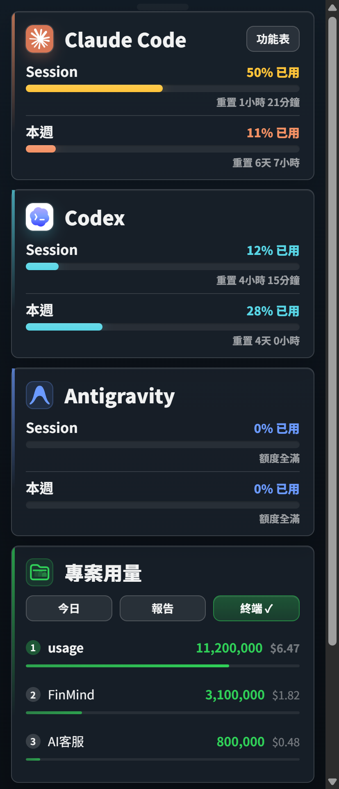
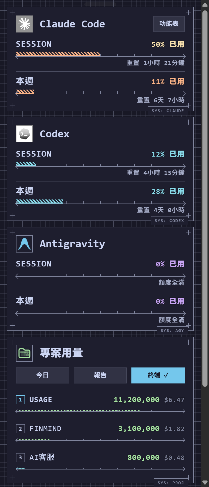
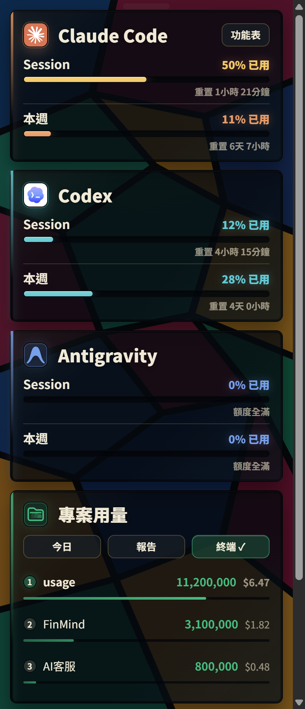
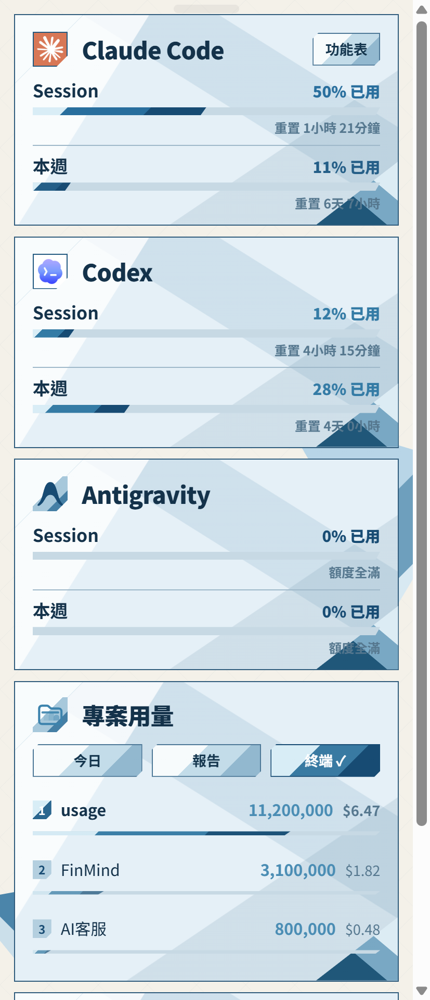

<p align="center">
  
</p>

# agentdeck — Windows AI Coding Cockpit

### 把 Claude Code、Codex 與 Antigravity 的額度、協作工具與報告集中到 Windows 系統匣

繁體中文 · [English](README.en.md) &nbsp;|&nbsp; [介紹頁](https://sanhsien.github.io/agentdeck/)

[](https://github.com/SanHsien/agentdeck/releases/latest)
[](https://github.com/SanHsien/agentdeck/actions/workflows/check.yml)
[](https://github.com/SanHsien/agentdeck/actions/workflows/codeql.yml)
[](https://www.python.org/)
[](#環境與安裝)
[](#資料與隱私)
[](LICENSE)

<p align="center">
  
</p>

**agentdeck** 是 Windows 專用的 AI coding cockpit。它把 Claude Code、Codex 與 Antigravity 的額度狀態常駐在系統匣，也把多模型圓桌討論、可部署的 subagent 角色、工作續接與本機用量報告放在同一個工具裡。

Claude Code 與 Codex 的額度資料來自**本機既有檔案**，不呼叫 Anthropic 或 OpenAI 的用量 API；Antigravity 額度則使用 Antigravity CLI 已有的登入身分查詢 Google 官方額度端點。

> **Windows-only fork。** 本 repo 衍生自 [`aqua5230/usage`](https://github.com/aqua5230/usage)，依 AGPL-3.0-only 獨立維護。macOS 支援已移除；需要 macOS 版請使用上游。

## 這是什麼

如果你同時使用多個 AI coding CLI，最常見的問題不是「沒有模型可用」，而是工作進行到一半才發現某個 provider 快撞額度、上下文已經過長，或上一個 session 的進度散落在不同工具裡。

agentdeck 把這些狀態放回 Windows 桌面工作流：

- **看額度**：系統匣常駐 Claude Code、Codex、Antigravity 的額度、重置時間與警戒狀態。
- **接續工作**：可選的進度管家、Token Saver、額度重置後自動續跑，減少重新交代上下文。
- **讓模型協作**：AI 圓桌可讓本機已安裝的 Claude Code、Codex、Antigravity 多輪討論與表決。
- **重用角色**：人才市場把同一組角色部署到 Claude Code、Codex 與 Cursor，並在覆寫同名角色前備份。
- **看長期趨勢**：HTML / CSV / PNG 報告整理每日、每週、專案與成本趨勢。

## 核心能力

| 能力 | 說明 |
|---|---|
| **Quota cockpit** | Windows 系統匣常駐額度、重置倒數、burn rate、Context Window 提醒與 Claude/Codex 公開服務狀態。 |
| **Claude Code / Codex 本機取數** | Claude 讀 statusLine hook 產生的本機快照；Codex 讀 `~/.codex/` 的 session / state 資料。查看額度本身不增加 LLM 用量。 |
| **Antigravity 額度** | 使用 Antigravity CLI 已有的本機登入身分，向 Google 官方額度端點查詢；不消耗模型額度。 |
| **AI 圓桌討論** | 選擇參與者、模型、角色與辯論風格，多輪討論、插話、共識計票，並可附唯讀資料夾。 |
| **AI 人才市場** | 開源角色定義放在 [`personas/`](personas/)；可部署到 Claude Code、Codex、Cursor，既有同名檔會先備份。 |
| **工作流輔助** | 進度管家、Token Saver、Token 浪費健檢，以及可選的額度重置後 Windows 排程續跑。 |
| **本機報告** | 深度 HTML 報告、CSV / PNG 匯出、專案趨勢與 Year in Review；可隱藏專案名稱。 |
| **Tray + TUI + CLI** | WebView2 系統匣面板為主要介面，也提供 Rich TUI 與終端機報告 CLI。 |

內建 4 款視覺主題：Classic、Catppuccin、彩繪玻璃、摺紙。主題只改外觀，共用同一份行為核心。

<p align="center">
  
  
  
  
</p>

## 快速開始

1. 從 [Latest Release](https://github.com/SanHsien/agentdeck/releases/latest) 下載 `agentdeck-windows.zip`。
2. 解壓後執行 `agentdeck.exe`；不需要安裝程式。
3. **Codex**：只要已有本機使用紀錄，agentdeck 會自動讀取。
4. **Claude Code**：在選單執行「設定狀態列」，安裝本機 statusLine hook；完成後重新啟動 Claude Code。
5. **Antigravity**：需先安裝並登入 Antigravity CLI，額度卡才會出現。

系統匣左鍵開面板、右鍵開選單。面板是可自由拖曳、會記住位置的浮動視窗；不是貼齊 tray icon 後點一下就消失的 popover。

## 資料與隱私

agentdeck 是 local-first，但「local-first」不等於完全不連網。不同 provider 的資料來源如下：

| 來源 | agentdeck 如何取得 | 是否連網 |
|---|---|---:|
| Claude Code | 讀 `~/.claude/agentdeck-status.json` 與本機專案紀錄 | 否 |
| Codex | 唯讀 `~/.codex/sessions/` / 本機 state 資料 | 否 |
| Antigravity | 讀本機 CLI 登入身分後查 Google 官方額度端點 | 是 |
| 服務狀態 | Claude / OpenAI 公開 Statuspage | 是 |
| 成本估算 | 公開價格表，本機快取；離線時可用內建 fallback | 是 |
| 更新檢查 | 本 repo 的 GitHub Releases API | 是，可關閉 |

**不會把 Claude Code / Codex 的對話紀錄上傳到本專案伺服器；本專案也沒有遙測後端。** AI 圓桌會啟動你本機已安裝的 provider CLI；這些 CLI 是否連網、傳送哪些提示與檔案內容，依各 provider 本身的行為與你的指令而定。

人才市場會寫入對應工具的 agent 設定目錄；若同名角色已存在，會先建立備份。Claude statusLine 安裝會修改 `~/.claude/settings.json` 的對應欄位並保留原值，以便解除安裝時還原。

完整資料位置、網路端點與授權說明見 [`NOTICE.md`](NOTICE.md) 與 [開發文件](docs/DEVELOPMENT.zh-TW.md)。

## 環境與安裝

- Windows 10 / 11
- Microsoft Edge WebView2 Runtime（Windows 10 / 11 通常已具備）
- 至少使用過 Claude Code、Codex 或 Antigravity 其中之一
- 只有從原始碼執行才需要 Python 3.13 與 `uv`

Release 提供可攜式 Windows zip 與 `.sha256`。正式下載與目前版本一律以 [Latest Release](https://github.com/SanHsien/agentdeck/releases/latest) 為準，不在 README 寫死版本號。

## 從原始碼執行

```powershell
uv sync --frozen --group dev --extra windows
uv run --no-sync python main.py            # Windows system tray
uv run --no-sync python main.py --tui      # Rich TUI
uv run --no-sync python main.py --mock     # 假資料預覽
uv run --no-sync python main.py --doctor   # 環境 / hook 診斷
uv run --no-sync python usage_cli.py report
```

完整驗證：

```powershell
pwsh tools/dev_check.ps1
```

CI 會檢查 lockfile、ruff、mypy、雙語文件 parity、受控檔案大小與 pytest。開發、打包與 Windows 陷阱見 [`docs/DEVELOPMENT.zh-TW.md`](docs/DEVELOPMENT.zh-TW.md)。

## Fork 與上游

agentdeck 是 [`aqua5230/usage`](https://github.com/aqua5230/usage) 的修改版本，而不是從零開始的原創 repo。這個 fork 自 2026-07-29 起朝 **Windows-only、繁中 / 英文雙語、獨立產品化** 發展，並持續選擇性審視上游更新。

主要差異包括：

- 移除 macOS menu bar / `.app` 路徑，Windows 系統匣與 WebView2 成為正式產品介面。
- 專案與新寫入的使用者資料名稱統一為 `agentdeck`。
- 加入 Antigravity、AI 圓桌、開源角色市場、Windows 自動續跑與多項 Windows 相容性修正。
- UI 語言收斂為繁體中文與英文。

逐項修改與 AGPL-3.0 §5a 聲明見 [`NOTICE.md`](NOTICE.md)；fork 同步方式見 [`docs/FORK.zh-TW.md`](docs/FORK.zh-TW.md)；上游 commit 採用 / 跳過紀錄見 [`docs/UPSTREAM.md`](docs/UPSTREAM.md)。

## 文件

| 文件 | 用途 |
|---|---|
| [`docs/DEVELOPMENT.zh-TW.md`](docs/DEVELOPMENT.zh-TW.md) | Windows 開發環境、驗證、打包與架構細節 |
| [`docs/PORTING.zh-TW.md`](docs/PORTING.zh-TW.md) | 從上游移植功能到 Windows 的原則與實例 |
| [`docs/DECISIONS.md`](docs/DECISIONS.md) | 重要產品 / 架構取捨 |
| [`docs/UPSTREAM.md`](docs/UPSTREAM.md) | 上游審視、已採用與 skipped commit |
| [`ROADMAP.md`](ROADMAP.md) | 產品方向與未來工作 |
| [`CHANGELOG.md`](CHANGELOG.md) | 逐版使用者可見變更 |
| [`NOTICE.md`](NOTICE.md) | fork attribution、修改聲明、資料與授權邊界 |
| [`SECURITY.md`](SECURITY.md) | 漏洞回報與支援政策 |

## 授權

**AGPL-3.0-only**。本 repo 是 `aqua5230/usage` 的衍生作品，保留上游著作權與授權聲明；本 fork 的修改同樣依 AGPL-3.0-only 發布。完整條款見 [`LICENSE`](LICENSE)，修改與來源聲明見 [`NOTICE.md`](NOTICE.md)。
