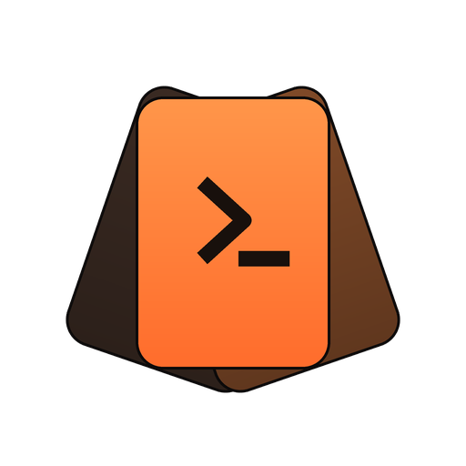
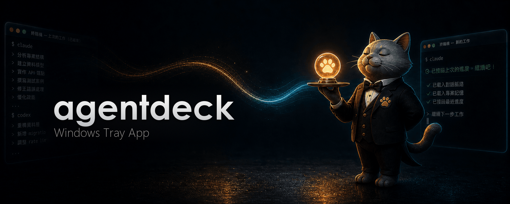
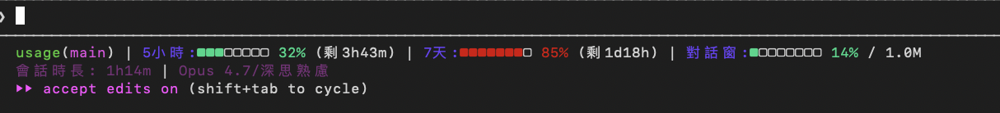

<p align="center">
  
</p>

# agentdeck

### 把 Claude Code、Codex 與 Antigravity 額度直接放進 Windows 系統匣

讓 Claude Code、Codex 與 Antigravity 的額度在工作時持續可見。`agentdeck` 把 session 限額、每週限額與成本脈絡放進 Windows 系統匣，讓你在工作被打斷前就先掌握用量。

繁體中文 · [English](README.en.md) &nbsp;|&nbsp; [介紹頁](https://sanhsien.github.io/agentdeck/)

[](https://github.com/SanHsien/agentdeck/releases/latest)
[](https://github.com/SanHsien/agentdeck/actions/workflows/check.yml)
[](https://github.com/SanHsien/agentdeck/actions/workflows/codeql.yml)
[](https://www.python.org/)
[](#安裝)
[](#隱私與資料來源)
[](LICENSE)

> **這個 fork 專注在 Windows。**
>
> 這是 [`aqua5230/usage`](https://github.com/aqua5230/usage) 的 fork，獨立維護、不回貢上游。開發與驗收都在 Windows 11 原生環境進行：Windows 專屬的問題（系統匣、DPI 縮放、路徑處理）會優先修，並附實測證據。
>
> **macOS 支援已於 2026-07-29 移除**：選單列（PyObjC）、`.app` 打包與相關程式碼都已刪除，PyObjC 相依也一併移除。要 macOS 版請用[上游](https://github.com/aqua5230/usage)。上游的 macOS 實作保留在 `reference/upstream-macos/` 供移植時對照。
>
> 其他差異：介面語言改為繁體中文與英文兩種；上游的 Discussions 與 star 數屬於原專案、本文件不再轉貼。介紹頁由本 repo 的 `docs/` 提供。

<p align="center">
  
</p>

`agentdeck` 把 **Claude Code、Codex 與 Antigravity** 的額度釘在系統匣，用顏色標好警戒級別，掃一眼就懂。Claude Code 與 Codex 的數字是被動讀自你機器上原本就在寫的本機檔案，讀取這些數字**不會呼叫 Anthropic 或 OpenAI 的 LLM API**——所以看額度這件事本身永遠不會增加你的用量。Antigravity 額度則來自 Google 官方額度端點，用的是 Antigravity CLI 本來就存在本機的登入身分。

## 為什麼需要 agentdeck？

長時間重構或除錯若依賴 Claude Code，無預警撞到額度上限代價很高。`agentdeck` 讓你在撞牆前就先看到 5 小時與每週限額，並且全程留在畫面上——不用停下來跑指令、也不用另外開頁面，答案就在你本來就在看的地方。

## 快速上手

從[最新 Release](https://github.com/SanHsien/agentdeck/releases/latest) 下載 `agentdeck-windows.zip`，解壓後執行 `agentdeck.exe` —— 無須安裝程式。

系統匣會出現額度圖示，左鍵開面板、右鍵開選單。完整設定流程見下方 [安裝](#安裝)。

## 你會得到什麼

### 即時可見性

- **常駐監控：** 額度常駐系統匣，顏色標示警戒級別（綠到紅）。點開能看 Session、Weekly 與各專案用量細節。
- **Antigravity 支援：** Antigravity（Gemini）的 Session 與每週額度以第三張卡片出現在每一款面板。數字直接向官方額度 API 查詢，用的是 Antigravity CLI 本來就存在你機器上的登入身分——每幾分鐘自動刷新，重置倒數即時遞減。
- **服務狀態警示：** Claude Code、Claude API 或 Codex API 發生故障或效能降級時，相關面板底部會顯示橘紅警示橫幅，數字只讀官方公開的 Statuspage.io 狀態頁——絕不呼叫 LLM 用量 API。Antigravity 因沒有可用的公開狀態頁，暫不支援。
- **上下文提醒與系統通知：** Context Window 達 70% 時，狀態列會提醒你 `/clear` 或 `/compact` 來避免浪費；也可自選開啟系統通知，在接近門檻或額度恢復時提醒。
- **獨立隱藏區塊：** 沒有全部都用？一鍵就能把 Claude Code、Codex 或 Antigravity 從系統匣及面板上徹底隱藏。

### 工作流程輔助

- **進度管家 (Progress Concierge)：** 開新對話時，自動把你上次的請求、未提交的 commits 與待辦清單交給 AI，不用重講一遍進度。完全本機、預設關閉。
- **省 token 模式 (Token Saver)：** 一鍵讓 Claude Code 與 Codex 講話更精簡，省下輸出 token，但程式碼與錯誤訊息保證一個字都不縮水。輕聲提醒維持精簡，長對話也不走鐘——實測對話後段回覆少約 40%。
- **Token 浪費健檢：** 每日背景診斷重複讀取檔案、污染目錄與雜訊輸出。當發現浪費時會有一行提示，AI 也能帶你看懂問題並給出改善建議。

### 報告與洞察

- **深度 HTML 報告：** 視覺化呈現每日與每週趨勢、專案排行與成本，包含帶有貢獻熱力圖與 Wrapped 摘要的 Year in Review。一鍵另存 .html／.csv／.png 分享，全程離線、可選擇隱藏專案名稱。
- **TUI 與 CLI 支援：** 偏好終端機的話，可用 `uv run --no-sync python main.py --tui` 開 Rich TUI 面板，或用 `uv run --no-sync python usage_cli.py report` 產出深度分析報告。

### 體驗與客製化

- **10 款視覺面板：** 可在 Classic、Matrix、Windows 95、Newspaper、Cloud Observation、Midnight Aquarium、Prism Arcade、Black Hole、World Cup 2026 與 Lepidoptera（藍曬圖）之間切換。
- **拖曳排序：** 按住任何一張額度卡上下拖曳就能交換順序，排法在所有主題間共用、重開也會記住。
- **AI 人才市場（自製版）：** 把預先寫好的 subagent 角色安裝進 `~/.claude/agents/`。上游這個功能靠一顆閉源二進位提供角色內容，來源與發佈 repo 對外都是 404、且只有 macOS 版，任何人 clone 公開 repo 都用不到。本 fork 改成**自己寫的開源實作**：角色定義放在 repo 的 [`personas/`](personas/)，可自行編輯與新增；安裝後若你手動改過該檔，面板會標示並提供還原。**若你原本已有同名 agent，安裝會先備份再覆寫，並告知備份檔名。**
- **AI 圓桌討論：** 開一個獨立視窗，讓 Claude Code、Codex、Antigravity 進行多輪討論——自選參與者、模型、AI 人才市場角色與辯論風格，開始前就看得到大約會花多少 token。可以在輪間插話引導方向，共識計票看得出誰不同意，並讓討論在全體同意時提早收尾。可附上唯讀資料夾讓參與者參考真實檔案。
- **AI 更新日報：** 開啟[更新彙整頁](https://sanhsien.github.io/agentdeck/ai-updates/)，涵蓋 Claude Code、Codex、Antigravity 與相關工具，附官方原文對照。頁面由本 repo 的 `ai_updates.json` 產生（`scripts/build_ai_updates.py`），資料隨上游同步更新。
- **神獸夥伴：** 百分比旁常駐一隻小型白色動畫神獸（Claude 是鳳凰，Codex 是飛龍，Antigravity 是獅子），各自跟著自家工具的 token 燃燒率動態加速。
- **自動多語言 (i18n)：** 介面支援繁體中文與英文，自動跟隨系統語言設定。所有中文語系（含簡體）都會套用繁體中文，其餘語系回退英文。

## 隱私與資料來源

- Claude Code 與 Codex 的數字**只讀本機紀錄檔**；讀取這些數字**不會呼叫 Anthropic 或 OpenAI 的 LLM API**。
- Antigravity 額度需要連網，而且只有你真的使用它才會發生：額度是用 Antigravity CLI 登入後存下的 OAuth 憑證，向 Google 官方額度端點查詢——依 CLI 版本不同，在 Windows 上，這個憑證讀自認證管理員或本機 token 檔（依 CLI 版本而定）。`agentdeck` 只讀取這個憑證而不寫回，任何刷新後的 access token 也只留在記憶體中；這個呼叫本身只讀額度資訊，絕不消耗你的模型額度。
- 背景連網範圍：上述 Antigravity 額度／token 端點、用來標示故障的 Claude 與 Codex 公開狀態頁、估算成本用的公開價格表（斷網會用內建預設），以及偶爾檢查 GitHub 版本更新。Claude Code 與 Codex 的紀錄檔內容不會被上傳。

## 檔案位置

`agentdeck` 是本機優先的工具，所有狀態都在你自己的磁碟上。它動到的東西只有這些：

| 路徑 | 用途 | 誰寫的 |
|---|---|---|
| `~/.claude/agentdeck-statusline.py` | 安裝進 Claude Code 的 statusLine hook | `--setup` |
| `~/.claude/agentdeck-status.json` | hook 每次刷新寫入的額度快照，UI 讀它 | hook |
| `~/.claude/agentdeck-preferences.json` | 主題、面板、開機自啟等偏好 | app |
| `~/.claude/settings.json` | 只改 `statusLine` 一欄；原值備份在 `settings["agentdeck"]["previousStatusLine"]` | `--setup` |
| `~/.agentdeck/` | 價格表、服務狀態、歷史紀錄等快取，加上圓桌討論與角色安裝狀態 | app |
| `~/.agentdeck-reports/` | 你按下「產生報告」時輸出的 HTML | app |
| `~/.claude/projects/`、`~/.codex/sessions/` | 用量來源 | **唯讀，不會寫入** |

`--unsetup` 會移除 hook 並還原 `settings.json` 的原值。快取目錄可以隨時整個刪掉，下次啟動會重建。

## 環境需求

- Windows 10 或 11
- 已經使用過 Claude Code、Codex 或 Antigravity（需有本機用量資料）
- （僅限從原始碼跑）Python 3.13

## 安裝

1. 到[最新 Release](https://github.com/SanHsien/agentdeck/releases/latest) 下載 `agentdeck-windows.zip`。
2. 解壓到任何位置，執行 `agentdeck.exe`。無須安裝程式、不寫登錄檔（除非你開啟「開機自啟」）。
3. 想開機自動啟動：右鍵選單勾選「開機時啟動」。

系統匣 UI 需要 Microsoft Edge WebView2 Runtime，Windows 10 與 11 通常已內建。

系統匣圖示會隨 Claude 額度百分比更新；提示文字摘要 Claude 與 Codex 的各視窗。左鍵用 WebView2 開啟 10 款主題面板；右鍵可切換面板、重新整理、設定開機自啟、檢查更新與結束。

面板**不貼齊系統匣圖示**，這是刻意的：它是可自由拖曳的浮動視窗，會記住你放的位置，點別處也不會消失。首次開啟的角落跟著工作列位置走（工作列在上方就開在右上，在左側就靠左），之後一律尊重你拖到的地方。上游後來也從「貼齊圖示的彈出視窗」改成同樣的浮動模型，理由正是貼齊會讓使用者無法自行擺放。

已知限制：更新提示用系統三鈕對話框，按鈕文字由 Windows 決定，因此三個選項的對應寫在訊息內容裡；AI 人才市場的角色內容是本 fork 自製的（[`personas/`](personas/)），與上游閉源版的角色不同。

## 從原始碼執行

```powershell
uv sync --frozen --group dev --extra windows
uv run --no-sync python main.py            # 系統匣（預設）
uv run --no-sync python main.py --tui      # 終端機 TUI
uv run --no-sync python main.py --mock     # 假資料預覽
uv run --no-sync python main.py --doctor   # 環境與 hook 診斷
```

需要 Python 3.13。開發環境完整說明見 [開發文件](docs/DEVELOPMENT.zh-TW.md)。

### 首次打開：設定狀態列

如果你用過 Codex，它會自動讀到資料。若是 Claude Code，請點選單彈窗內的**「設定狀態列 (Set Up Status Line)」**按鈕來安裝同步 hook。
完成後請完全關閉 Claude Code 再重開（不是只關視窗）。

設定完成後，Claude Code 視窗底部會出現這樣的狀態列：

<p align="center">
  
</p>

## 主題展示

內建 **10 款可切換的視覺主題**，可直接在 UI 中切換：

<p align="center">
  
  
  
  
  
  
</p>

## 常見問題排查

如果顯示 `--` 先別急，絕大多數情況只是還沒有本機資料。

| 症狀 | 原因 | 解法 |
|------|------|------|
| 系統匣圖示顯示 `--` | 尚無資料或 hook 未更新 | 先跑一次 Codex。若為 Claude Code，點擊「設定狀態列」或跑 `uv run --no-sync python main.py --setup` |
| 不小心按到「結束」 | 程式已終止 | 重新執行 `agentdeck.exe`。 |
| 顯示「N 分鐘未更新」 | Claude Code 未執行 | 打開 Claude Code 跑一下就會更新 |
| Codex 區塊空白 | 找不到 Codex 紀錄 | 用 Codex 跑一次對話 |
| 今日花費是 $0.00 | 價格表對不上或抓取失敗 | 刪掉 `~/.agentdeck/pricing_cache.json` 重新抓取 |
| Antigravity 卡片沒出現 | 未安裝或未登入 Antigravity CLI | 安裝並登入 Antigravity CLI，背景額度查詢成功後卡片會自動出現 |

## 跟其他工具比較

| 功能 | agentdeck | ccusage | TokenTracker |
|------|:-----:|:-------:|:------------:|
| 一直在螢幕上 | ✅ | — | ✅ |
| Windows 系統匣 | ✅ | — | — |
| Claude Code 與 Codex 支援 | ✅ | 僅 Claude | ✅ |
| Antigravity（Gemini）支援 | ✅ | — | — |
| Claude Code 與 Codex 服務狀態警示 | ✅ | — | — |
| HTML 深度報告與 UI 面板 | ✅ | ✅ | — |
| AI 人才市場 | 未提供 | — | — |
| AI 圓桌討論 | ✅ | — | — |
| AI 更新日報 | ✅ | — | — |
| 進度管家與省 token 模式 | ✅ | — | — |
| Token 浪費健檢 | ✅ | — | — |
| 讀取額度時不呼叫 LLM API | ✅ | ✅ | ✅ |
| 開源授權 | AGPL-3.0 | MIT | — |

## 文件

| 文件 | 內容 |
|---|---|
| [Windows 開發文件](docs/DEVELOPMENT.zh-TW.md) | 建環境、六道閘門、打包、容易踩的地方 |
| [移植手冊](docs/PORTING.zh-TW.md) | 把上游的 macOS 功能搬到 Windows 的方法，含三個實際踩過的稽核錯誤 |
| [決策紀錄](docs/DECISIONS.md) | 為什麼這樣做、以及當初否決了什麼 |
| [上游追蹤](docs/UPSTREAM.md) | 已審視／已合併的上游 commit，與不採用的理由 |
| [fork 說明](docs/FORK.zh-TW.md) | 本 fork 專屬檔案與同步流程 |
| [Repo Review](REPO_REVIEW.md) | 當前健康狀態與未解問題 |
| [變更紀錄](CHANGELOG.zh-TW.md) | 逐版變更 |
| [貢獻指南](CONTRIBUTING.md) | 送 PR 前該知道的事：閘門、雙語文件規則、版號規則 |
| [安全性政策](SECURITY.md) | 支援版本與漏洞回報方式 |

## 開發

想跑 TUI、設定 agent 或自己打包？完整說明在 **[Windows 開發文件](docs/DEVELOPMENT.zh-TW.md)**；移植 macOS 功能到 Windows 的方法見 **[移植手冊](docs/PORTING.zh-TW.md)**。

## 其他可參考專案

以下專案只作**概念與流程參考**，不是 `agentdeck` 的執行依賴，也沒有任何原始碼被併入本專案。授權未宣告的專案在法律上等同保留所有權利，無法併入本 AGPL-3.0 repo，因此僅供觀念對照。

| 名稱 | 授權 | 可參考點 |
| --- | --- | --- |
| [karpathy/llm-council](https://github.com/karpathy/llm-council) | 未宣告 | 多模型協作回答同一問題的三階段流程：各模型獨立作答 → 匿名互評排名 → 由「主席」模型彙整成最終答案。與本專案「AI 圓桌討論」的多輪討論、共識計票屬同一類設計，其中**匿名互評**（隱藏模型身分以避免評分偏向名氣）是值得對照的做法。技術上走 OpenRouter + FastAPI + React，與本專案直接驅動本機 CLI、離線運作的路線不同。 |
| [gkfriend/codex-usage-companion](https://github.com/gkfriend/codex-usage-companion) | MIT | 同樣是 Windows 專用、本機優先、無遙測的 Codex 額度常駐顯示，解的是同一個問題。**取數路徑不同，值得對照**：它註冊 Codex 外掛的 `SessionStart` / `Stop` hook，並讀本機 `codex app-server` 的 rate-limit 通知，是事件驅動；`agentdeck` 則掃 `~/.codex/sessions/*.jsonl`，不需使用者安裝任何東西。它附掛在 Codex Desktop 視窗上、只管 Codex；`agentdeck` 是獨立系統匣程式，涵蓋 Claude Code、Codex 與 Antigravity。技術上是 C# / .NET 8。授權為 MIT，與 AGPL-3.0 單向相容——真要借用程式碼在法律上可行，但目前沒有借用。 |

## 授權

採用 **AGPL-3.0-only**（見 [LICENSE](LICENSE)）。原始著作權屬上游作者 lollapalooza，原專案：
https://github.com/aqua5230/usage

本 fork 的所有修改同樣以 AGPL-3.0-only 釋出，並保留上游的著作權聲明與授權條款。若你再 fork 或散布衍生版本，必須一併提供對應的完整原始碼、沿用 AGPL-3.0 並標注來源；透過網路提供服務時同樣負有提供原始碼的義務。完整聲明見 [`NOTICE.md`](NOTICE.md)。
